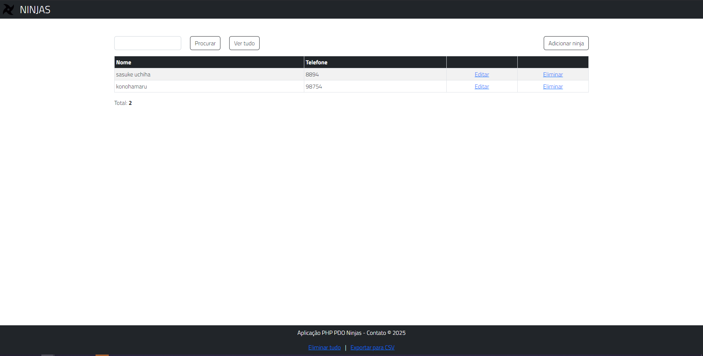

# Projeto de cadastro de ninjas

Este projeto foi desenvolvido em PHP usando PDO (PHP Data Objects) e é voltado para o aprendizado de conceitos de desenvolvimento web, como PHP, HTML, Bootstrap e SQL. O projeto foi realizado em aula sob a orientação do professor <a href="https://www.udemy.com/user/f8dafc2f-5f70-4007-a0db-4df14696b5c6/" target="_blank">João Ribeiro</a> e tem como objetivo praticar a interação entre o front-end e o back-end, bem como o uso de banco de dados com SQL.

## Tecnologias usada
- PHP
- PDO
- HTML
- BOOTSTRAP
- SQL

## Funcionalidades do projeto
- Cadastro de novos ninjas
- Verificação de duplicidade 

## Pré-requisitos
- PHP 7 ou superior
- Banco de dados MySQL
- Servidor local (ex: laragon)